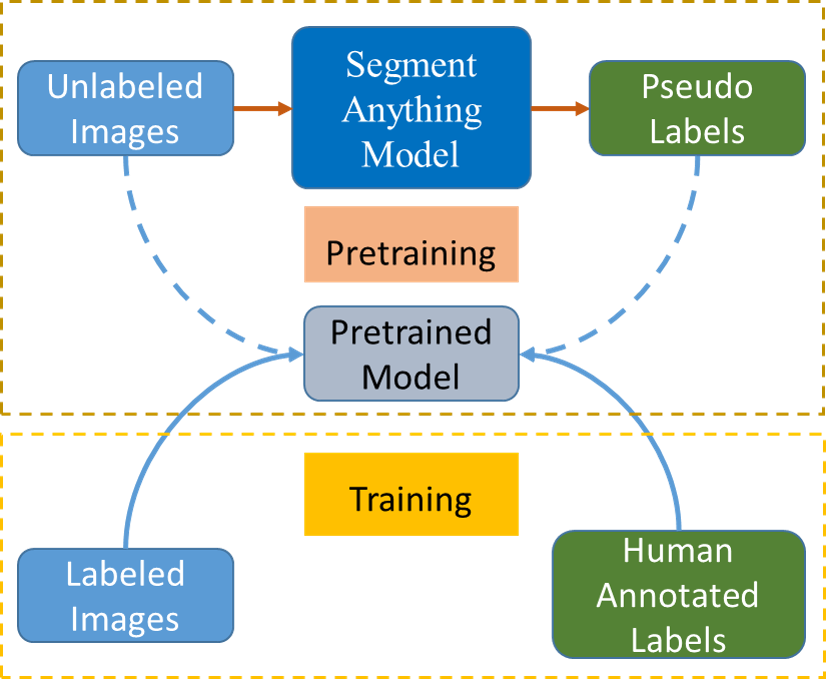

This code repository provides a method for generating pseudo labels for thermal infrared image segmentation using the Segment Anything Model (SAM). 
This method can be used to pretrain segmentation models for specific categories with minimal labeled data.

 
 

